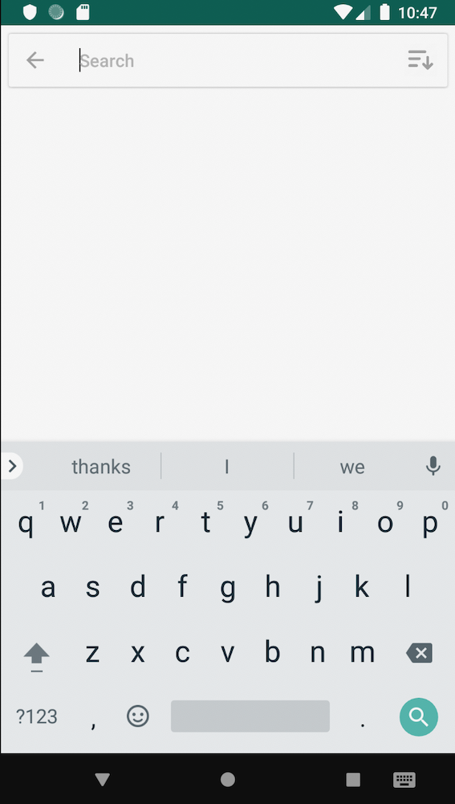

Android UrbanDictionary
=========================

Urban Dictionary for Android.  
Urban Dictionary app! Urban Dictionary is the online dictionary with definitions written by everyone

This App consumes Urban Dictionary API (https://rapidapi.com/community/api/urban-dictionary/endpoints)

## Arquitecture
* Kotlin
* MVVM
* [ViewModel][2] - Store UI-related data that isn't destroyed on app rotations. Easily schedule
     asynchronous tasks for optimal execution.
* [LiveData][1] - Build data objects that notify views when the underlying database changes.

## HTTP
* Retrofit2
* Gson converter
* RxJava adapter

## UI
* RecyclerView
* [DiffUtil][6] - Utility class that can calculate the difference between two lists and output a list of update operations that converts the first list into the second one.
* ConstaintLayout
* [Fragment][4] - A basic unit of composable UI.
* [persistentsearchview][5] - Android library designed to simplify the process of implementing search-related functionality.

## DI
* Dagger2

## Test
* JUnit
* Mockito

[1]: https://developer.android.com/topic/libraries/architecture/livedata
[2]: https://developer.android.com/topic/libraries/architecture/viewmodel
[3]: https://developer.android.com/guide/topics/ui
[4]: https://developer.android.com/guide/components/fragments
[5]: https://github.com/mars885/persistentsearchview
[6]: https://developer.android.com/reference/android/support/v7/util/DiffUtil

Screenshots
-----------

Possible Alternatives/Enhancements
-----------------

Assumptions
-----------------
